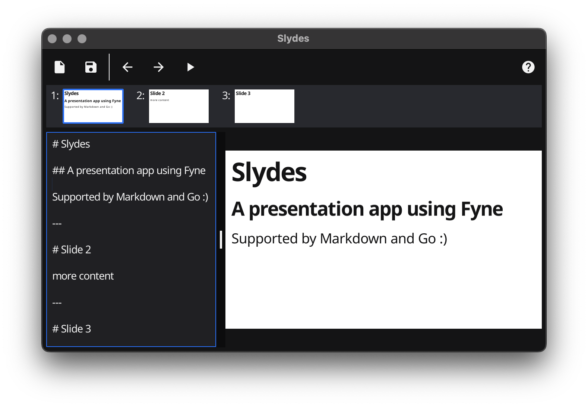
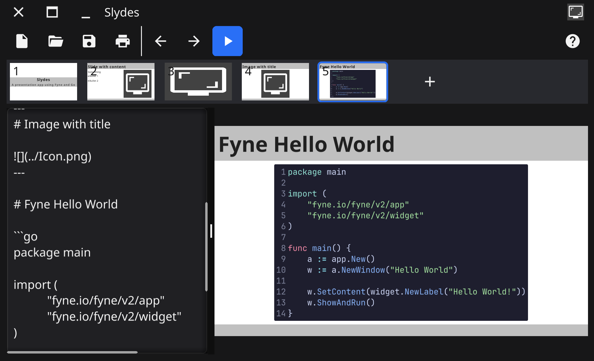

<p align="center">
  <a href="https://apps.fyne.io/" style="text-decoration: none"></a>
</p>

# Slydes

A presentation app using Fyne and Markdown



## Format

Each presentation is a simple markdown file.
It also supports toml front matter for configuration, such as theme.

```md
+++
theme = "matrix"
+++

# Heading
## Subheading

---

# Slide 2

Content for slide

---

# Bullets

* First
* Second
* Third

```

## Code styling

You can include styled text using fenced or indented code blocks.
When using the fenced (\`\`\`) block you can specify the language too, as follows:

    ```go
    func hello() {
        log.Println("hello")
    }
    ```



Thanks to the excellent [goshot](https://github.com/watzon/goshot) project for
providing the code rendering support!